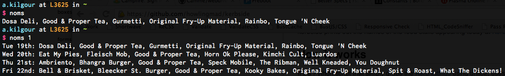

kerbside
==========
kerbside prints out the names of the food stalls appearing today at [Kerb King's Cross](http://www.kerbfood.com/kings-cross/).
	
	
How it works
------------
It's a Python script that simply grabs the [Kerb listings](http://www.kerbfood.com/kings-cross/) using urllib2, uses BeautifulSoup to scrape the relevant data, and spits back the names of the stalls.

Will show you either today's listings, or listings for the rest of the week
	
	
How does it look
----------------
Like this:

	
Simple, huh?

Requirements
------------
Python, and it's reliant upon [BeautifulSoup](http://www.crummy.com/software/BeautifulSoup/) to parse the HTML … if you see the following error:

	ImportError: No module named BeautifulSoup

… then try installing BeautifulSoup:

	$ easy_install BeautifulSoup

**You may need to use 'sudo' if it won't install**

(That's obviously the thing to do for the other modules as well, should they be missing.)

Should you wish to display the information on your desktop, like me, then (on OS X) you'll be wanting to grab the fantastic [GeekTool](http://projects.tynsoe.org/en/geektool/). Grab it even if you couldn't care less about Kerb. GeekTool is *brilliant*!
	
	
Installation
------------
	$ mkdir -p ~/bin
	$ curl -skL https://github.com/howlingmad/kerb/raw/master/noms >~/bin/noms
	$ chmod +x ~/bin/noms
	
Make sure `~/bin` is in your `$PATH` - or put the `noms` script somewhere else on your `$PATH`.
	
	
Usage
-----
By default you will see the traders for the current day.

	$ noms

By adding an argument of '1' you will see the stalls on each day for the rest of the current week.

	$ noms 1

!NEW! If you add the argument '2' then there will be no CLI output, but will instead write the data to json format.

	$ noms 2
	
I trigger the command 'noms 1' using [GeekTool](http://projects.tynsoe.org/en/geektool/) so that I have the info displaying on my desktop.
	
	
Author
------
Alex Kilgour   
-- [http://kil.gr](http://kil.gr)   
-- [@howlingmad](http://twitter.com/howlingmad)